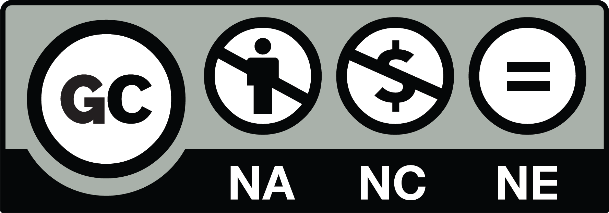

# Gossiping Commons

*Ever wondered if you can share a gossip? Now there is a license framework for that!*

"WORK" IN PROGRESS (feel invited to join, contribute, or distract me (the last one is significantly easier))

It was intended to be for the April Fools' Day (2019), but I didn't take this deadline too seriously.
Plus, you know, it is hard to compete with all these corporate adverts.

## Example licenses

### No author please, and don't tell anyone

It if is a secret, it is a secret! So, don't tell anyone anything. Especially that you know that from me!

It is a strict restriction and I will honor that!
I mean, I know can share with Max, because I am are sure they won't share it with anyone!

* [Just Don't Tell Anyone Else](http://thedoghousediaries.com/3023) - The Doghouse Diaries

### Don't tell all of that

The best way to protect privacy is to make sure all derivative work has changes, step by step, making it unrecognizable.

The power of gossips is the creative spirit of exaggerations, misheard words, wrongly attributed intentions, and stuff. It has created civilizations. Now, you can use it to your boring anecdotes as well!

E.g.:

> A friend of mine solicited her student to act in an adult movie with pterodactyls.

Well, if we trace the creative chain, the last version I know... well, I cannot tell previous versions.
But I guarantee it was enriched in a gradual way, but a lot of people.

* [Jesus na terra 2](https://www.umsabadoqualquer.com/966-jesus-na-terra-2/) - Um Sábado Qualquer

### Don't be Judas, no exaggerations

Workplace "wisdom of crowds" has different rights. You really want to be free from slanders, and have your career intact. By a rat backstabbing you in an exchange for a company meeting in Bali.

So, how to handle goss-, I mean, Social Information™?

Writing of your (true!) stories you told them during integration parties, writing blog posts changing the protagonist name to their own, and monetizing on adverts would not be cool.

Also, selling your friend for ₿3.0 is not cool. And well, if you use this license, it is also illegal.

### Whatever, tell whomever you please!

Good press is good press. Bad press is good press. There is no such things a bad publicity. Have you ever hear about bad likes or reshares?

Stunt marketing owes a lot [this piece of ancient wisdom]((https://en.wikipedia.org/wiki/Herostratus).

[CC0 - no rights reserved](https://creativecommons.org/share-your-work/public-domain/cc0/). A more polite version of [WTFPL](http://www.wtfpl.net/).

## Downloads

[Files (svg and png) are here.](https://github.com/stared/gossipingcommons/tree/master/imgs)

## License

This project is [CC-BY](https://creativecommons.org/licenses/by/4.0/) [Piotr Migdał](https://p.migdal.pl/).

It is a derivate work of [Creative Commons buttons and cons](https://creativecommons.org/about/downloads), which are [CC-BY licensed]((https://creativecommons.org/licenses/by/4.0/)).

## Contribute!

All jokes aside, we should never forget that gossiping is a collaborative process.
Psst -  we can be quiet about that.

### More logos!

- all combinations!
- also small ones!
- or a magic generator!

### Localizations

Let's translate it into Español, Русский, 官话, العربية, עִבְרִית‎ (OMG I ❤️ UTF-8!), sarcasm, LaTeX, IPA (/aɪ piː ˈeɪ/, not a craft beer, you hipster!), `JavaScript`, black tongue, etc.

If you happen to know the indescribable language of the Great Old Ones, fork repo, checkout new branch, commit changes, rebase -i it to origin/master, push it to remote and send pull request. Otherwise, [clicking on the pen is the way to go](https://github.com/stared/gossipingcommons).

## One more thing

Oh, an one more thing: please don't tell about this site anyone. Let's that be our secret! ;)

Especially not [Facebook](https://www.facebook.com/sharer/sharer.php?u=https%3A//gossipingcommons.org). Or [Twitter](https://twitter.com/share?text=Gossiping%20Commons%20-%20"don't%20share%20alike"%20and%20"no%20author%20please"%20licenses%20@pmigdal&url=https://gossipingcommons.org&hashtags=GossipingCommons,OpenSource). Or [Hacker News](https://news.ycombinator.com/submitlink?u=https%3A%2F%2Fgossipingcommons.org&t=Gossiping%20Commons%20-%20open%20licenses%20for%20grapevine%20news). Or [LinkedIn](https://www.linkedin.com/shareArticle?mini=true&url=https%3A//gossipingcommons.org&title=Gossiping%20Commons%20-%20%22don't%20share%20alike%22%20and%20%22no%20author%20please%22%20licenses&summary=&source=https%3A//gossipingcommons.org). Or all of them at once!
